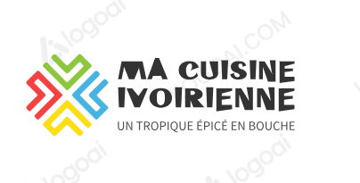
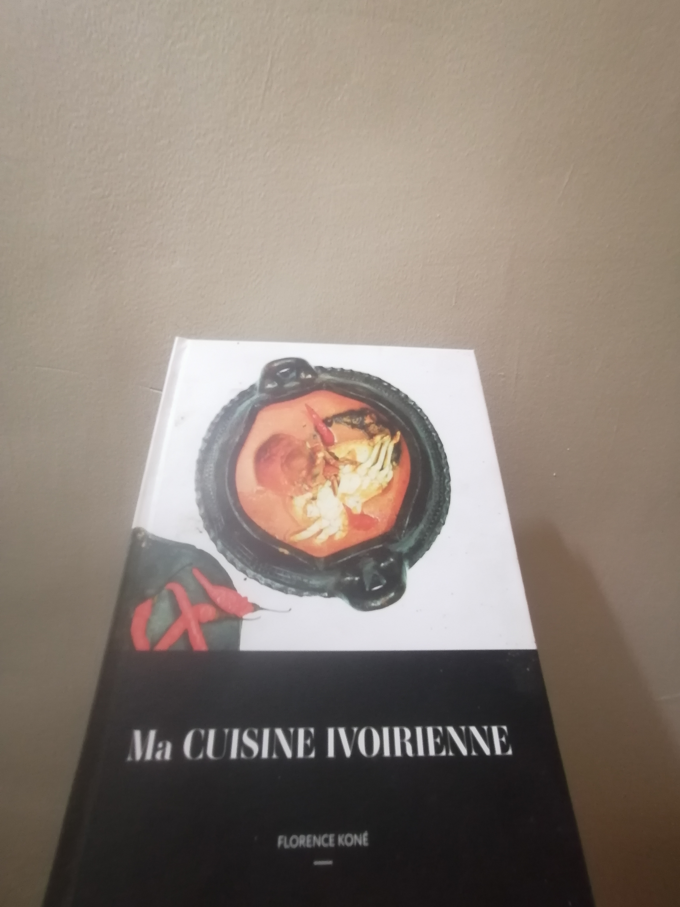

# WORKOUT Y24W04: LIVRE DE CUISINE ---(codebase from y23w42)---
## LOGO: 

## PRÉFACE DU LIVRE "MA CUISINE IVOIRIENNE"
<!--  -->

### AI UTILISÉ POUR
- CRÉATION DE LOGO: https://www.logoai.com/make ou encore [google "ai generating logo"](https://www.google.com/search?q=ai+generating+logo&oq=ai+generating+logo&gs_lcrp=EgZjaHJvbWUyBggAEEUYOdIBCDM5NjJqMGo0qAIAsAIA&sourceid=chrome&ie=UTF-8)

